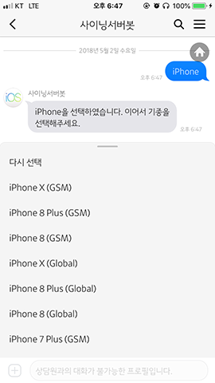

# 카카오 플러스 친구 사이닝서버봇
아이폰이나 아이패드 기종별로 사이닝 서버가 열려있는 버전을 ipsw.me 사이트 통하지 않고 실시간으로 확인하기 위해
카카오 챗봇으로 구현하였습니다.

## 개발 환경
- Python(3.6.4)
- Django(2.0.4)

## 배포 환경
- AWS EC2

## example

## 사용
~~- 플러스 친구 이름 : 사이닝서버봇~~
~~- 검색용 아이디 : signingbot~~
~~- 홈 URL : http://pf.kakao.com/_iNhxaC~~

18/8/26 EC2 서버 배포 중단
